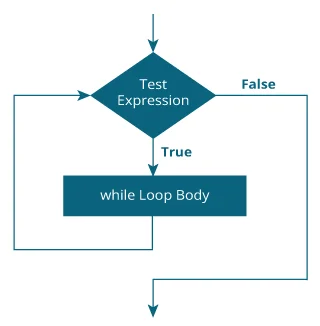
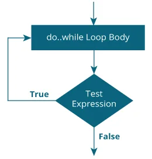

## How while loop works?
The while loop evaluates the testExpression inside the parentheses ().
If testExpression is true, statements inside the body of while loop are executed. Then, testExpression is evaluated again.
The process goes on until testExpression is evaluated to false.
If testExpression is false, the loop terminates (ends).





## What are do While loops

The do..while loop is similar to the while loop with one important difference. The body of do...while loop is executed at least once. Only then, the test expression is evaluated.

The syntax of the do...while loop is:
```
do {
  // the body of the loop
}
while (testExpression);


```
## How do...while loop works?
* The body of do...while loop is executed once. Only then, the  testExpression is evaluated.
* If testExpression is true, the body of the loop is executed again and testExpression is evaluated once more.
* This process goes on until testExpression becomes false.
If testExpression is false, the loop ends.
* other benefit for do ..while is prevent duplicates code 



* One of the benefits of using a `do...while` loop is that it can help prevent duplicate code in certain situations.


## Difference between `while` and `do...while` loops in C

The main difference between `while` and `do...while` loops in C is the order in which the loop condition is evaluated.

In a `while` loop, the condition is evaluated at the beginning of each iteration. If the condition is true, the loop body is executed; if it is false, the loop is exited:

```
while (condition) {
  // loop body
}
```

In a `do...while` loop, the condition is evaluated at the end of each iteration. This means that the loop body is always executed at least once, even if the condition is false:

```
do {
  // loop body
} while (condition);
```

So, the main difference is that a `do...while` loop will always execute its body at least once, while a `while` loop may not execute its body at all if the condition is false from the beginning.

Another difference is that the scope of any variables declared inside the loop body is different between the two loop types. In a `while` loop, the scope of the variables is limited to the loop body, while in a `do...while` loop, the scope of the variables extends beyond the loop body to the code that follows the loop.